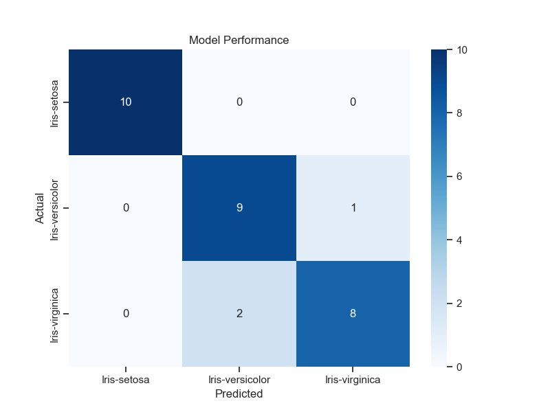
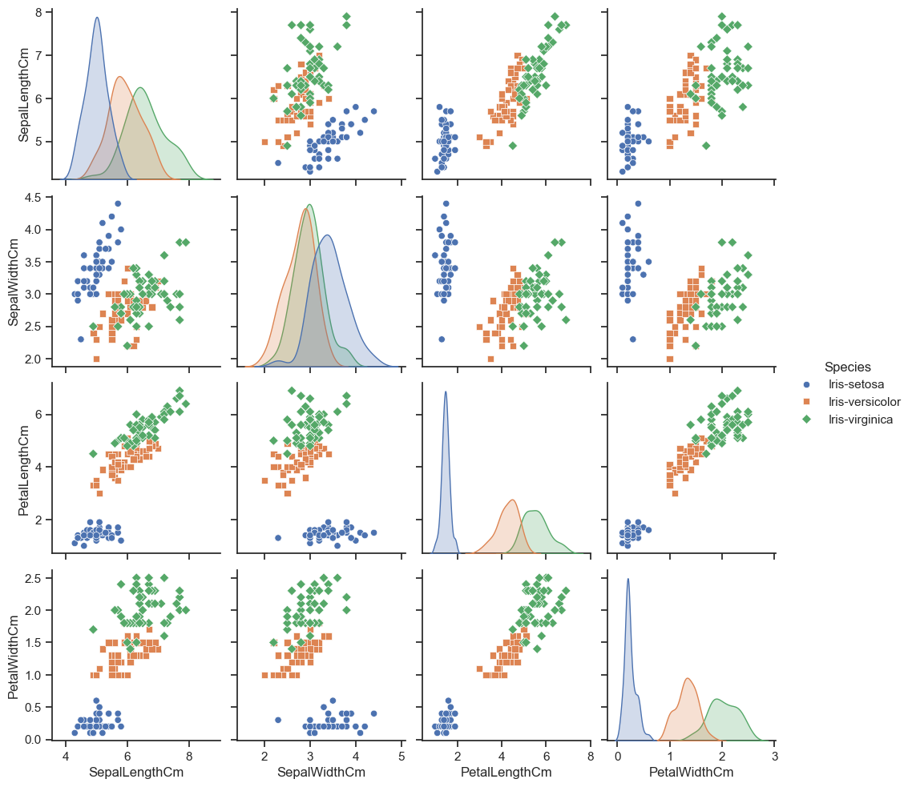

# Iris Species Classification

## How to use:

1. Install libraries: `pip install -r requirements.txt`
2. Open a Python script or terminal and run the logic.

iris-classification/
├── main.py # The code above goes here
├── data/
│ └── Iris.csv
├── models/ # (Will contain iris_rf_model.pkl after running)
├── outputs/ # (Will contain your PNG plots after running)
└── src/
├── **init**.py
├── data_preprocessing.py
├── train_model.py
├── predict.py
└── visualize.py # Make sure you created this file!

## 📊 Model Evaluation

To understand how well the Random Forest model is performing, we use two main visualizations located in the `outputs/` folder.

### 1. Confusion Matrix

The Confusion Matrix allows us to see exactly where the model is making correct predictions and where it is getting confused between species.

- **Diagonal Cells:** Represent correct classifications.
- **Off-Diagonal Cells:** Represent misclassifications (e.g., the model predicted _Versicolor_ but it was actually _Virginica_).

### 2. Feature Relationship (Pairplot)

This visualization shows how the different measurements (Sepal Length, Sepal Width, etc.) help separate the three species.

- **Iris-Setosa** is easily separable from the other two species.
- **Versicolor and Virginica** have some overlap, which is where the model is most likely to make errors.

## 🚀 How to Interpret the Output

When you run `python main.py`, the script uses the trained `iris_rf_model.pkl` to predict a sample.
Example Input: `[5.1, 3.5, 1.4, 0.2]`
Example Output: `Iris-setosa`
